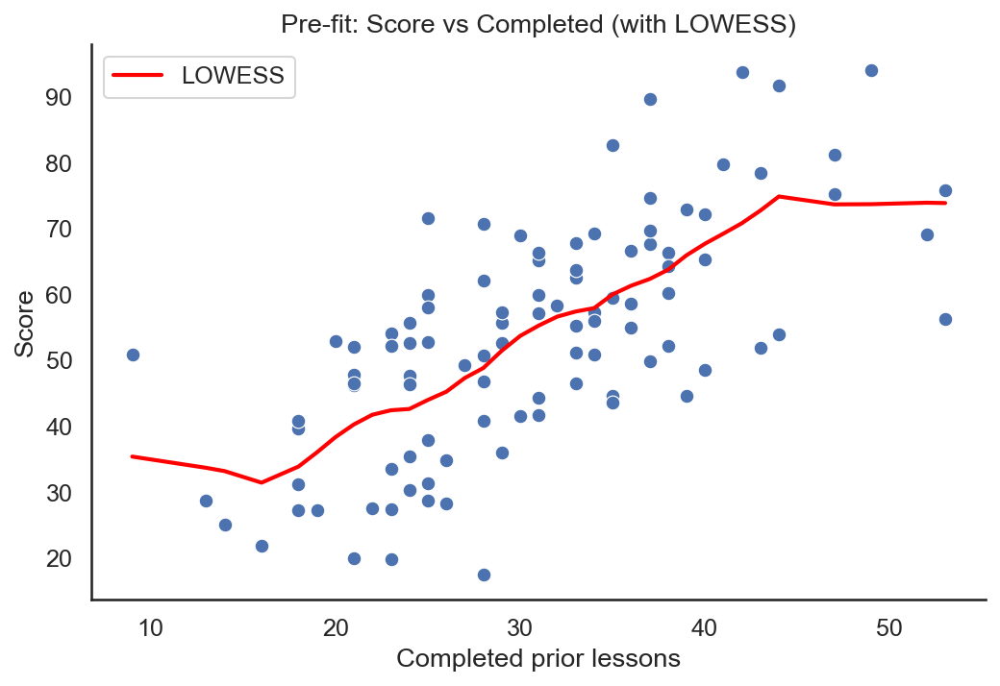
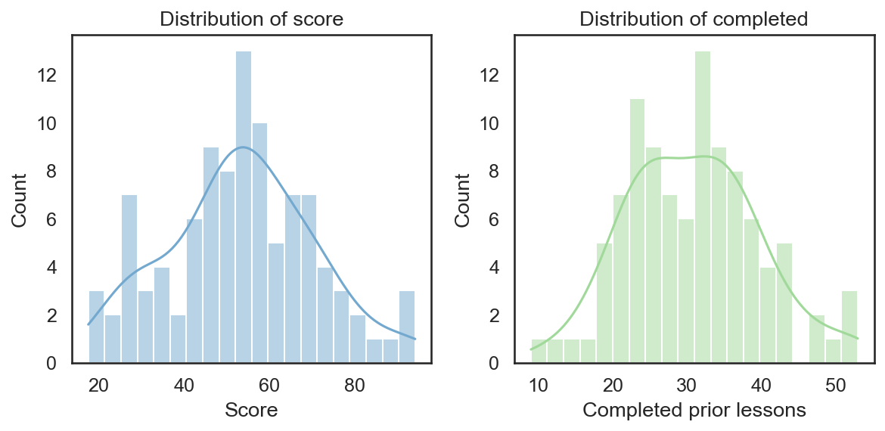
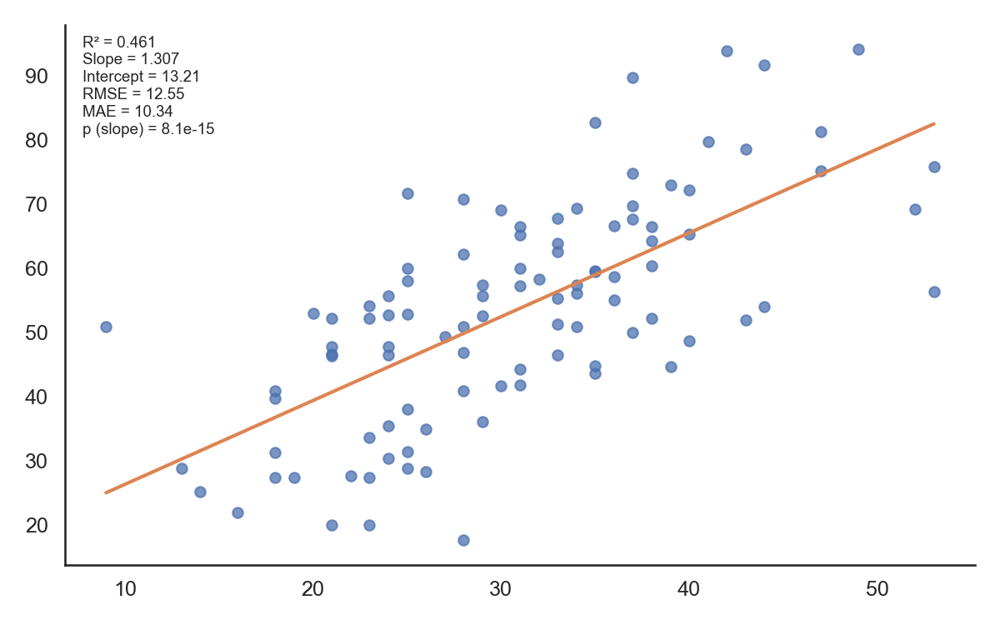
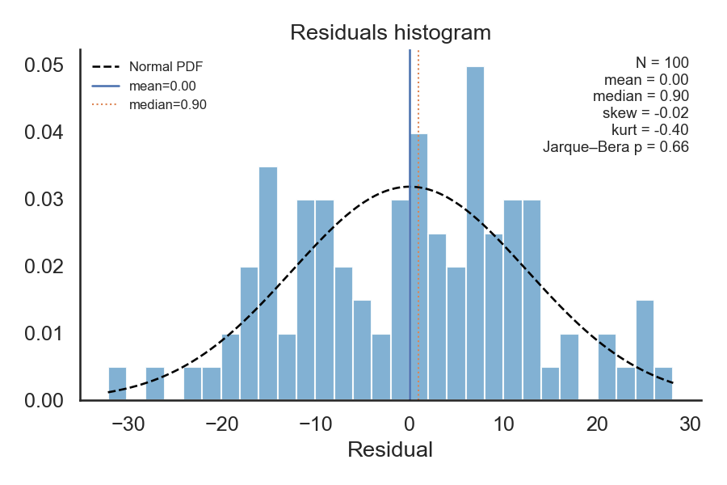
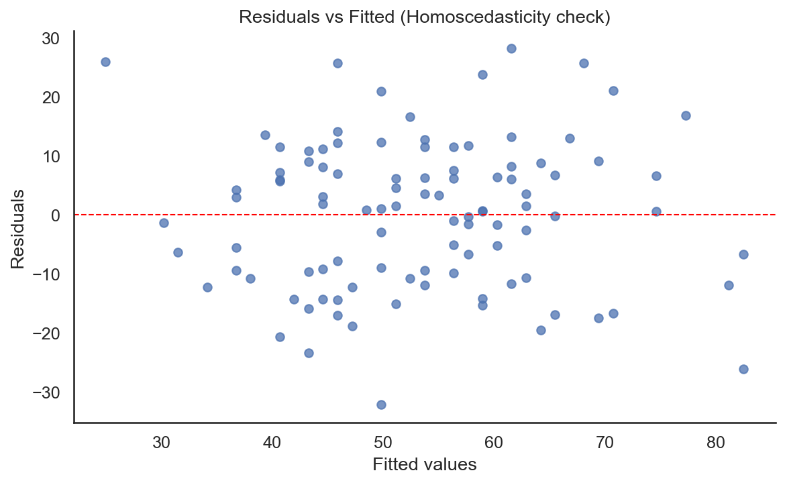
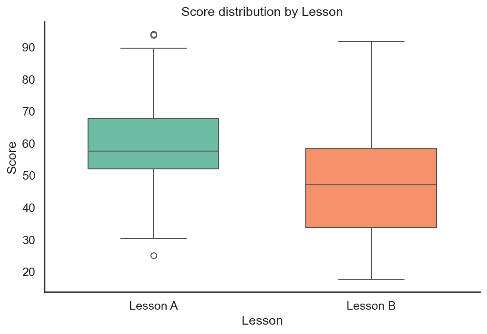
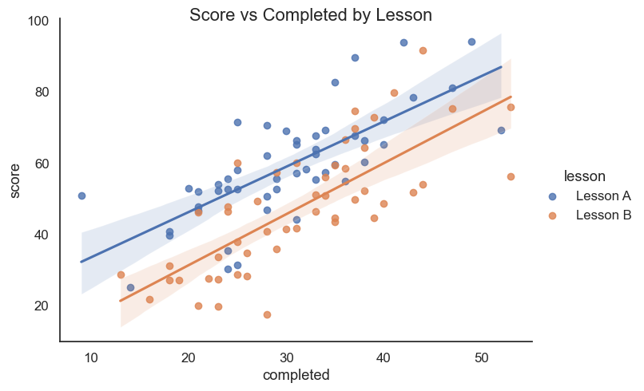

# Linear Regression for Students Scores

This small project demonstrates exploratory data analysis and a simple linear regression predicting student `score` from `completed` prior lessons.

## Purpose
- Show how to inspect assumptions for linear regression (linearity, distribution, outliers, homoscedasticity).
- Fit a simple OLS model and produce diagnostic plots and summary metrics.
- Provide reproducible plots saved to `figures/` for reporting.

## Files
- `Student_Grades.py` — script that runs pre-fit checks, fits OLS models, and saves/shows annotated figures.
- `codecademy.csv` — dataset (keep private; do not upload personal data to public repos).
- `figures/` — generated images (see list below).

## How to run
1. Place `codecademy.csv` in the same folder as `Student_Grades.py`.
2. Install dependencies (recommended inside a virtualenv):

```powershell
python -m venv .venv
.\.venv\Scripts\Activate.ps1
pip install pandas numpy matplotlib seaborn statsmodels
```

3. Run the script:

```powershell
python Student_Grades.py
```

The script will save figures to `figures/` and display them during the run.

## Results (summary)
- Model: `score ~ completed` (OLS)
  - Intercept: 13.214
  - Slope (completed): 1.307
  - R-squared: 0.461
  - Pearson correlation (score, completed): 0.679
  - Example prediction: `completed = 20` → predicted score ≈ 39.35

- Model: `score ~ lesson` (categorical)
  - Lesson A mean ≈ 59.22
  - Lesson B mean ≈ 47.58
  - Difference (B vs A) ≈ -11.64 points

## Interpretation
- There is a moderate positive association between prior lessons completed and score: each additional completed lesson corresponds to about a 1.31 point increase in score on average. The model explains ~46% of score variance — useful but not exhaustive.
- The lesson comparison suggests students in Lesson B scored lower on average than Lesson A; this could reflect differences in lesson difficulty, cohorts, or sampling and should be investigated further.
- Pre-fit checks (LOWESS, histograms) indicate a reasonably linear trend and no extreme z-score outliers. Residual diagnostics (histogram + normal overlay, residuals vs fitted) are provided; inspect `residuals_hist_metrics.png` and `residuals_vs_fitted_metrics.png` for approximate normality and homoscedasticity.

## Figures (generated)
The script saves these figures in `figures/` and they are displayed when the script runs.

- Pre-fit scatter + LOWESS:  
  

- Pre-fit distributions (score, completed):  
  

- Annotated scatter with fit + metrics:  
  

- Residuals histogram with normal overlay + stats:  
  

- Residuals vs Fitted (homoscedasticity):  
  

- Boxplot by lesson:  
  

- Scatter + regression lines by lesson:  
  
